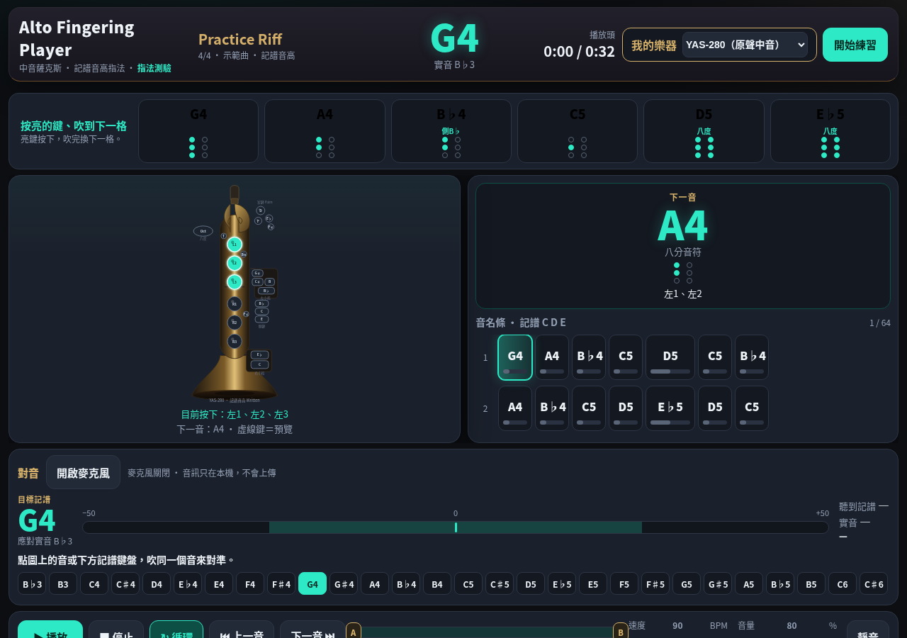
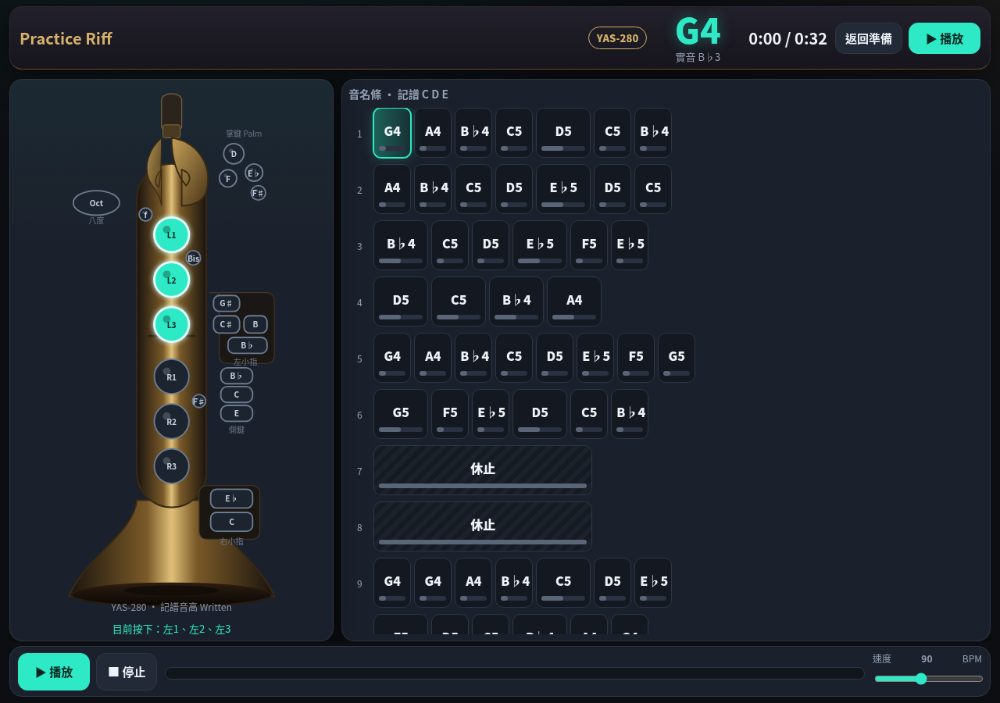
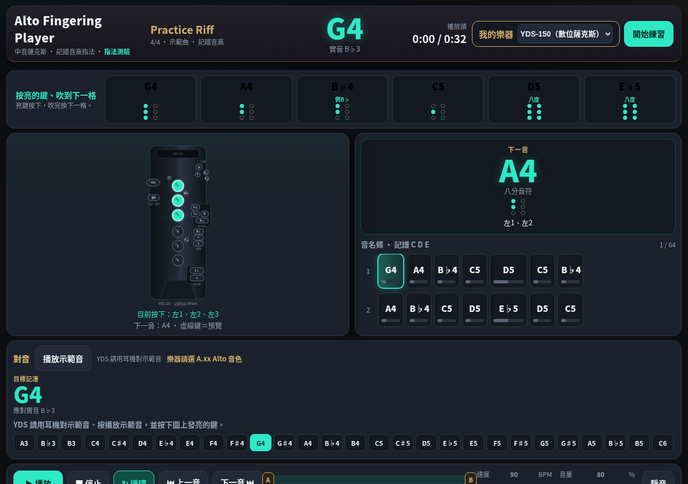
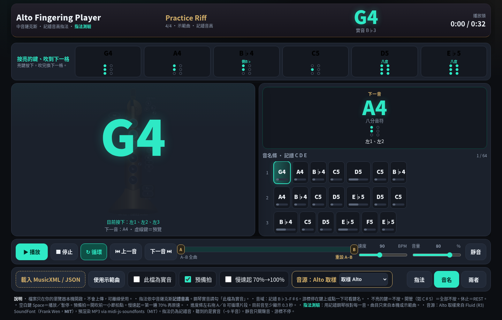
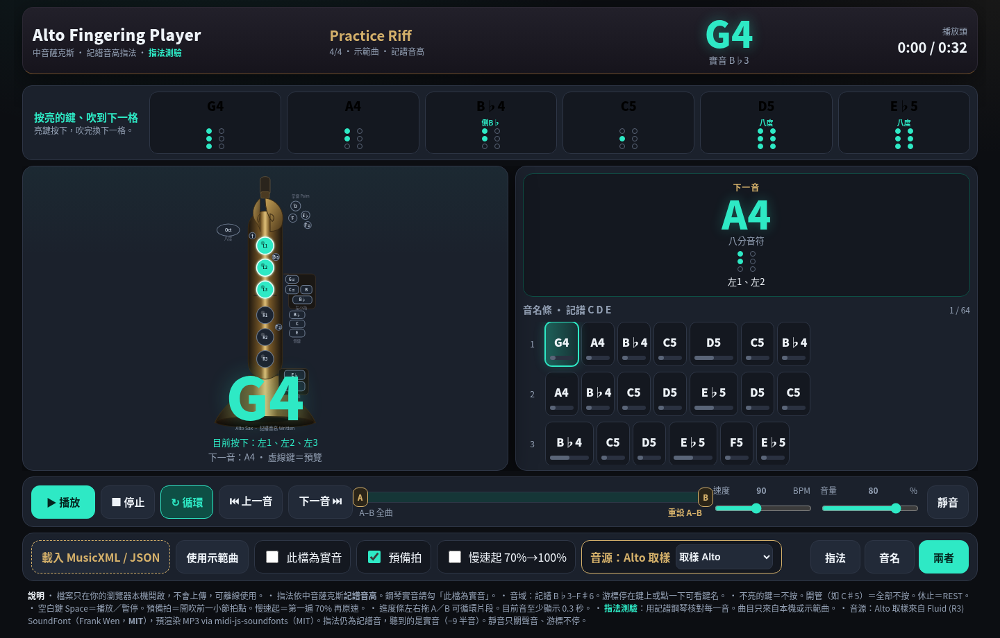
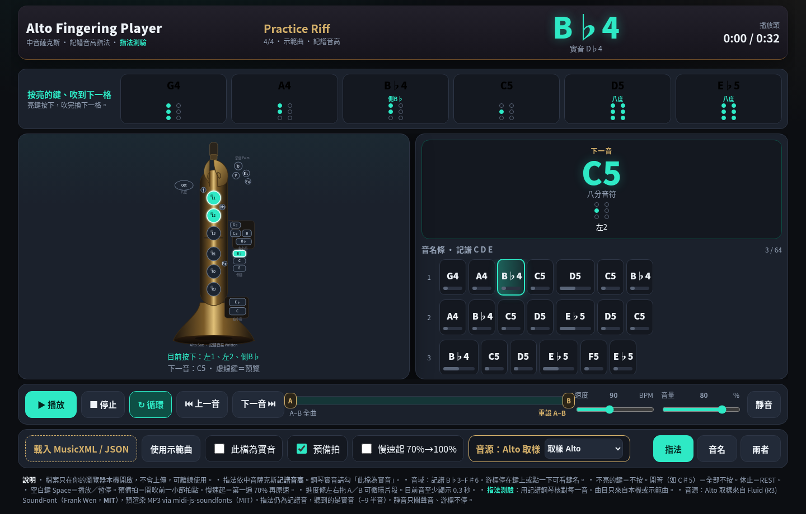
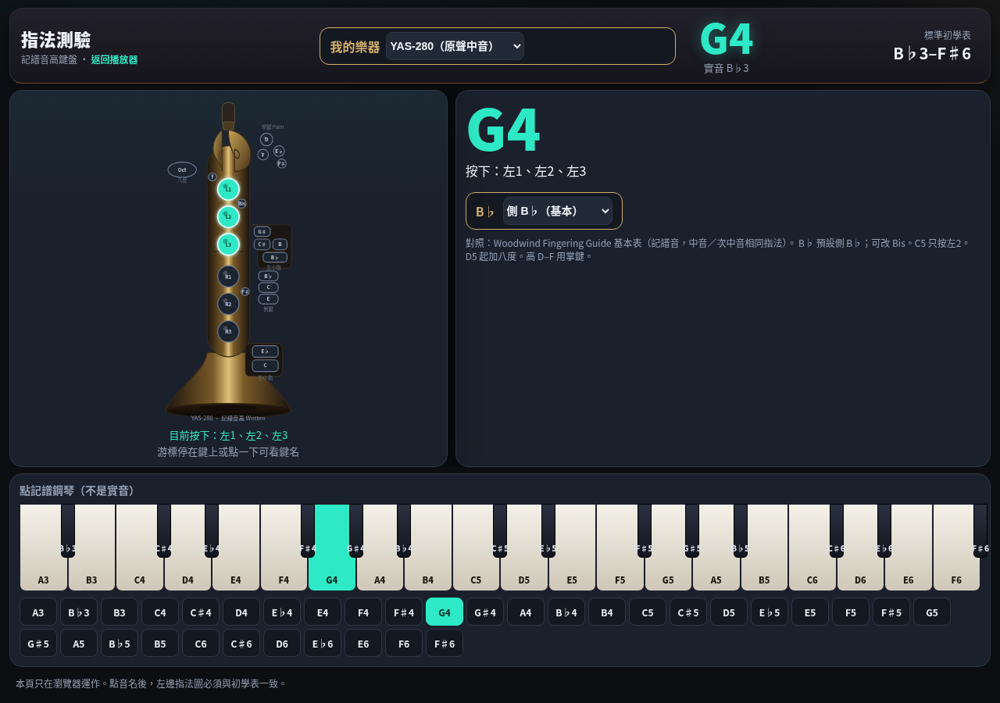
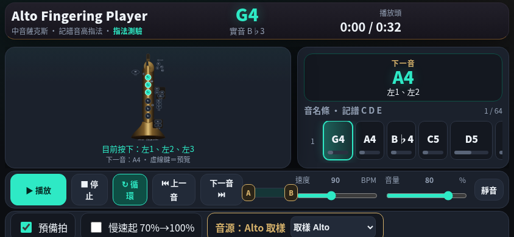

# Alto Fingering Player

**中音薩克斯指法跟吹器** — 看亮鍵、聽實音、不用先會讀唱名。

開頁就有示範曲。樂譜只在你的瀏覽器裡打開，沒有帳號、沒有曲庫伺服器。

[線上試用](https://ergeargwer.github.io/alto-fingering-player/) · [指法測驗](https://ergeargwer.github.io/alto-fingering-player/fingering-test.html) · [原始碼](https://github.com/ergeargwer/alto-fingering-player)



---

## 這是給誰用的

給剛拿到中音薩克斯、會按幾個音、但不想盯著唱名或五線的人。

你要做的只有三步：**看亮的鍵 → 吹到這一格結束 → 換下一格。**  
畫面上的 G4、B♭4 是譜上的記譜音；喇叭裡是真正從管子出來的實音。

不適合：需要完整原譜還原、多聲部和聲、或遠端共享曲庫的情境。那些請繼續用 MuseScore。

---

## 設計理念

1. **指法是主角，譜是配角。**  
   中間那支薩克斯圖要大到在練習室燈下也能看。亮鍵＝按，虛線鍵＝下一音預覽。音名條只幫忙對拍，不逼你讀譜。

2. **記譜給手指，實音給耳朵。**  
   中音薩克斯是 E♭ 管。圖上、測驗鋼琴、JSON 都是**記譜音**；取樣播放是記譜減大六度（−9 半音）。不要用鋼琴 App 的 C 去對圖上的 C。

3. **開頁就能吹，壞檔也不能卡住。**  
   內建 Practice Riff。MusicXML 解析失敗會講清楚原因，示範曲繼續可播。沒有登入牆。

4. **練習節奏比炫技重要。**  
   預備拍、慢速起、A–B 循環、十六分音符至少顯示 0.3 秒——都是為了讓手指跟得上，不是做一個迷你 DAW。

5. **本機、可離線、不蒐集樂譜。**  
   你選的 `.musicxml` 不會上傳。公開倉庫也沒有別人的歌曲庫。圖是原創 SVG，不是抄現成跟吹網站。

---

## 功能一覽

| 面向 | 你會看到什麼 |
|------|----------------|
| **即時指法** | 原創薩克斯鍵位圖，亮鍵＋下一音虛線預覽；鍵上可點／停看中文鍵名 |
| **跟吹播放** | 播放／暫停／停止／循環、空白鍵、上一音下一音、速度 40–160 BPM |
| **下一音卡** | 右側大音名、時值、小指法點、要按哪些鍵 |
| **音名條** | 以小節排列的 C D E 格子，目前音反白，時值條會縮小 |
| **顯示模式** | 指法／音名／兩者，給不同練習階段 |
| **準備／練習** | 準備＝選譜、對音、調速度；**開始練習**後只留指法 1/3＋音名條 2/3。停止不會離開練習 |
| **練習教練** | 預備拍一小節、A–B 片段循環、慢速起 70%→100%、最少顯示 300ms |
| **本機樂譜** | 載入 MusicXML、JSON 或壓縮 **.mxl**；多聲部下拉；「此檔為實音」才移調 |
| **本機清單** | 「選擇樂譜資料夾」列出本機曲目（例如 `Music/scores`），不上傳、不做成公開曲庫 |
| **我的樂器** | YAS-280 原聲中音（預設）或 YDS-150 數位薩克斯。只換指法圖，樂譜不重載 |
| **對音** | YAS-280：本機麥克風（記譜 G4＝實音 B♭3）。YDS-150：耳機示範音，不用麥 |
| **B♭ 指法** | 預設側 B♭（初學表）；可改 Bis |
| **音源** | FluidR3 Alto 取樣（預設）或簧片合成；靜音不關游標 |
| **指法測驗** | 記譜鋼琴，點一音核對整張表；可切 YAS-280／YDS-150 |

---

## 畫面

**準備畫面（預設）** — 選樂器、對音、載譜。YAS-280 原聲圖。


**練習畫面** — 薄頂欄；左指法約 1/3、右音名條約 2/3。停止／暫停不會離開。



**YDS-150** — 直列 1–6 鍵＋Oct／低 A。對音改為耳機示範音。



**音名模式** — 先認 G、A、B♭，再對手指。



**兩者** — 圖與名一起看。



**B♭ 的側鍵** — 基本表用側 B♭，不是只亮左 1。



**指法測驗** — 用記譜鋼琴逐音對表，不靠猜。



**橫向矮螢幕** — 指法圖優先，播放列仍在。



---

## 操作說明

### 第一次打開

1. 用瀏覽器開 [GitHub Pages](https://ergeargwer.github.io/alto-fingering-player/)，或本機：

   ```bash
   python3 -m http.server 8765 --directory .
   # 然後開 http://127.0.0.1:8765/
   ```

   取樣音檔走 `fetch`，請不要用 `file://` 直接雙擊 HTML。

2. 畫面上已是示範曲 **Practice Riff**（4/4、90 BPM、記譜音）。上方六張小卡：G A B♭ C D E♭，對應「按亮的鍵、吹到下一格」。

3. 按 **播放** 或空白鍵。若「預備拍」有勾，會先打一小節（1–4）再開始。

4. 看左邊亮鍵吹完這一格；準備畫面右邊大卡是**下一音**。

5. 準備好後按 **開始練習**：只留薄頂欄、指法圖（約 1/3）與音名條（約 2/3）。停止／暫停不會離開練習；按 **返回準備** 才回來。

6. **對音**見下一節。只在準備畫面；按 **開始練習** 後麥克風會關。

### 我的樂器

準備畫面必選 **我的樂器**（會記住）：

| 型號 | 圖 | 音域 | 對音 |
|------|----|------|------|
| **YAS-280（原聲中音）** | 原聲管身指法圖 | 記譜 B♭3–F♯6，無低 A、無高 G | 麥克風，實音 → 記譜 +9 |
| **YDS-150（數位薩克斯）** | 直列 1–6 鍵＋Oct／低 A | 同上，另有低 A（記譜 A3） | 不用麥；耳機聽示範音，按亮鍵 |

譜一律當中音薩**記譜音**。選 YDS-150 時畫面上會提示：**樂器請選 A.xx Alto 音色**。

### 對音

只在**準備**畫面（還沒按「開始練習」）。音訊只在這台機器的瀏覽器裡算，不會上傳。

1. 若畫面被擋住，往下捲到 **對音** 那一列。
2. 按 **開啟麥克風**。Safari／Chrome 會問權限，請選允許。  
   若被拒：網址列左邊的鎖頭／麥克風圖示 → 允許本頁使用麥克風，再按一次。
3. 先選定**目標記譜音**（圖上亮的那個），三種點法一樣：
   - 上方六張小卡（G A B♭ C D E♭）
   - 音名條的某一格
   - 對音列最下面那排記譜鍵盤（B♭3–F♯6）
4. 看「應對實音 …」，用調音器或耳朵對那個**實音**吹。薩克斯圖與目標都是記譜；喇叭／對音聽到的是實音。  
   例：目標 **G4** → 應對實音 **B♭3**（記譜 −9 半音）。
5. 長吹穩一點（約 0.3 秒）才改判定。太輕會顯示「聽不到音」。

| 你會看到 | 意思 |
|----------|------|
| 指針在中間綠區、綠字「準了」 | 記譜音對了，且誤差小於 25 音分 |
| 黃字「偏高／偏低」 | 同一個記譜音，差 25–50 音分；往反方向修 |
| 紅字「你吹的記譜是 A4，目標是 G4」 | 吹成別的音了，先對指法再吹 |
| 指針 ±50 | 刻度兩端；超出仍顯示在邊上 |
| 「聽到記譜」「實音」「¢」 | 機器此刻聽到的記譜名、實音名、相對目標的音分 |

**不會做的事：** 對準了不會自動跳下一格、不會幫你翻譜。對完一個音，自己點下一個目標再吹。

**關掉：** 再按一次按鈕（變成「關閉麥克風」），或按 **開始練習**（練習模式不用麥）。切到別的分頁也會關。

**開不起來時：**

| 情形 | 作法 |
|------|------|
| 沒有權限 | 瀏覽器允許麥克風後再按「開啟麥克風」 |
| 找不到麥克風 | 接上或啟用本機麥克風 |
| 被占用 | 關掉其他正在用麥的 App |
| `file://` 或非 HTTPS | 用 http://127.0.0.1:8765/ 或 GitHub Pages |
| iPad | 用 Safari；第一次允許後若沒聲，再按一次按鈕 |

調音器 App 若設成鋼琴／實音 C，不要拿它的 C 去對圖上的 C。圖上 C＝中音薩記譜 C。

### 播放列

| 控制 | 作用 |
|------|------|
| 播放／暫停 | 空白鍵相同。暫停後再播**不會**重打預備拍 |
| 停止 | 回到 A 點（預設曲首），下次播放會再打預備拍 |
| 循環 | 播到 B 跳回 A。預設 A–B＝全曲 |
| 上一音／下一音 | 跳格子，指法立刻換 |
| 進度條 | 點一下跳時間 |
| A／B 把手 | 左右拖，只循環中間那段。「重設 A–B」回到全曲 |
| 速度 | 40–160 BPM。播放中改速度不重頭 |
| 音量／靜音 | 靜音只關喇叭，格子與指法繼續走 |

**慢速起 70%→100%：** 勾選後，第一遍用你設的速度 × 0.7，第二遍起原速。角上會出現「第一遍 70%」。

### 三種顯示

底列 **指法**／**音名**／**兩者**。給手指、給認音、或兩個一起。選擇會記住。

### 載入自己的譜

1. **載入 MusicXML / JSON / MXL**，選本機檔。檔案不會離開這台機器。
2. 或按 **選擇樂譜資料夾**，指向本機 `Music/scores`（或 MuseScore 的 Scores）。下方會依資料夾分組列出 `.musicxml`／`.mxl`／`.json`。Chromium 會記住這個資料夾；其他瀏覽器重新整理後需再選一次。
3. 譜若是鋼琴／實音，勾 **此檔為實音**（記譜＝實音 +9 半音）。Alto 分譜通常不要勾。
4. 兩個聲部以上會出現 **聲部** 選單，選旋律那軌。
5. 解析失敗會有紅字，示範曲仍可播。按 **使用示範曲** 隨時回來。

支援的 MusicXML 重點：`<pitch>`（step／alter／octave）、`<duration>`、`<voice>`、`<rest>`、`divisions`、`<sound tempo>` 或 `<metronome>`。歌詞、力度、和弦加音會忽略。壓縮 `.mxl`（ZIP 內的 MusicXML）可直接載入。

**B♭：** 底列可選側 B♭（基本表，預設）或 Bis。改了立刻套用到目前曲，不必重載。

JSON 範例（`dur`＝四分音符為 1 拍）：

```json
{
  "title": "練習",
  "bpm": 90,
  "notes": [
    { "pitch": "G4", "dur": 0.5 },
    { "rest": true, "dur": 4 }
  ]
}
```

### 指法測驗頁

標題旁點 **指法測驗**，或開 `fingering-test.html`。

- 鍵盤是**記譜音**，不是鋼琴實音
- 點白鍵／黑鍵／下方半音鈕，左邊圖必須對初學表
- 游標停在薩克斯鍵上或點一下，會浮出中文鍵名
- B♭ 會另外標備用 Bis，預設仍是側 B♭

建議先對：G4、A4、B♭4、C5（只按左 2）、D5（加八度）。

### 音源

標籤 **音源：Alto 取樣**

| 選項 | 何時用 |
|------|--------|
| 取樣 Alto | 預設。FluidR3 六個音變速，聽起來像薩克斯 |
| 後備合成音 | 取樣怪怪的、或想要較輕的合成氣聲 |

聽到的是實音：圖上 G4 ≈ 喇叭 B♭3。

---

## 指法與音高（請記住）

- 音域：記譜 **B♭3–F♯6**（YDS-150 另有低 A＝記譜 A3）。超出顯示「音域外」
- 表： [Woodwind Fingering Guide](https://www.wfg.woodwind.org/sax/sax_bas_1.html) 基本表  
  - **G4**＝左 1 2 3，無八度  
  - **C5**＝只按左 2（不是長笛、也不是六孔）  
  - **B♭**＝左 1 2 + 側 B♭（預設）；可改 Bis＝左 1 + Bis  
  - **D5 起**加八度；高 D–F 用掌鍵  
- 開管（如 C♯5）＝全部不按。休止＝不亮鍵

完整對照與改碼注意事項在 [`開發紀錄.md`](開發紀錄.md)。

---

## 授權

- 程式與原創指法圖：[MIT](LICENSE)
- 六音 MP3：Fluid (R3) SoundFont（Frank Wen，MIT），預渲染 via [midi-js-soundfonts](https://github.com/gleitz/midi-js-soundfonts)（MIT）。見 [`samples/LICENSE.txt`](samples/LICENSE.txt)
- Practice Riff 為本專案原創練習句

**不是** PlayThatSheet 的複製，也沒有公開歌曲庫。
